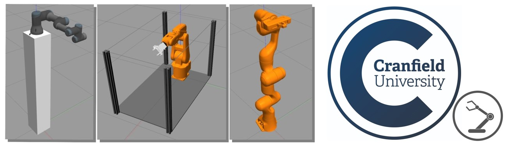

<div id="top"></div>

<!-- 

# ===================================== COPYRIGHT ===================================== #
#                                                                                       #
#  IFRA (Intelligent Flexible Robotics and Assembly) Group, CRANFIELD UNIVERSITY        #
#  Created on behalf of the IFRA Group at Cranfield University, United Kingdom          #
#  E-mail: IFRA@cranfield.ac.uk                                                         #
#                                                                                       #
#  Licensed under the Apache-2.0 License.                                               #
#  You may not use this file except in compliance with the License.                     #
#  You may obtain a copy of the License at: http://www.apache.org/licenses/LICENSE-2.0  #
#                                                                                       #
#  Unless required by applicable law or agreed to in writing, software distributed      #
#  under the License is distributed on an "as-is" basis, without warranties or          #
#  conditions of any kind, either express or implied. See the License for the specific  #
#  language governing permissions and limitations under the License.                    #
#                                                                                       #
#  IFRA Group - Cranfield University                                                    #
#  AUTHORS: Mikel Bueno Viso - Mikel.Bueno-Viso@cranfield.ac.uk                         #
#           Seemal Asif      - s.asif@cranfield.ac.uk                                   #
#           Phil Webb        - p.f.webb@cranfield.ac.uk                                 #
#                                                                                       #
#  Date: October, 2022.                                                                 #
#                                                                                       #
# ===================================== COPYRIGHT ===================================== #

# ======= CITE OUR WORK ======= #
# You can cite our work with the following statement:
# IFRA (2022) ROS2.0 ROBOT SIMULATION. URL: https://github.com/IFRA-Cranfield/ros2_RobotSimulation.

-->

<!--

  README.md TEMPLATE obtined from:
      https://github.com/othneildrew/Best-README-Template
      AUTHOR: OTHNEIL DREW 

-->

<!-- HEADER -->
<br />
<div align="center">
  <a>
    
  </a>

  <br />

  <h2 align="center">ROS2.0 ROBOT SIMULATION - ROS2.0 Foxy</h2>

  <p align="center">
    IFRA (Intelligent Flexible Robotics and Assembly) Group
    <br />
    Centre for Robotics and Assembly
    <br />
    Cranfield University
  </p>
</div>

<!-- TABLE OF CONTENTS -->
<details>
  <summary>Table of Contents</summary>
  <ol>
    <li>
      <a href="#about">About</a>
      <ul>
        <li><a href="#intelligent-flexible-robotics-and-assembly-group">IFRA Group</a></li>
        <li><a href="#ros2_robotsimulation-repository">ros2_RobotSimulation Repository</a></li>
      </ul>
    </li>
    <li>
      <a href="#getting-started">Getting Started</a>
      <ul>
        <li><a href="#ros20-foxy-environment-set-up">ROS2.0 Foxy Environment Set-Up</a></li>
        <li><a href="#import-and-install-ros2_robotsimulation-repository">Import and install ros2_RobotSimulation Repository</a></li>
      </ul>
    </li>
    <li><a href="#supported-robots">Supported Robots</a></li>
    <li>
      <a href="#ros2-packages">ROS2 Packages</a>
      <ul>
        <li><a href="#ros2_data">ros2_data</a></li>
        <li><a href="#ros2_actions">ros2_actions</a></li>
        <li><a href="#ros2_execution">ros2_execution</a></li>
        <li><a href="#ros2_grasping">ros2_grasping</a></li>
      </ul>
    </li>
    <li><a href="#contributing">Contributing</a></li>
    <li><a href="#license">License</a></li>
    <li><a href="#cite-our-work">Cite our work</a></li>
    <li><a href="#contact">Contact</a></li>
    <li><a href="#acknowledgments">Acknowledgments</a></li>
  </ol>
</details>

<!-- ABOUT THE PROJECT -->
## About

### Intelligent Flexible Robotics and Assembly Group

The IFRA (Intelligent Flexible Robotics and Assembly) Group is part of the Centre for Robotics and Assembly at Cranfield University.

IFRA Group pushes technical boundaries. At IFRA we provide high tech automation & assembly solutions, and we support smart manufacturing with Smart Industry technologies and solutions. Flexible Manufacturing Systems (FMS) are a clear example. They can improve overall operations and throughput quality by adapting to real-time changes and situations, supporting and pushing the transition towards flexible, intelligent and responsive automation, which we continuously seek and support.

The IFRA Group undertakes innovative research to design, create and improve Intelligent, Responsive and Flexible automation & assembly solutions, and this series of GitHub repositories provide background information and resources of how these developments are supported.

### ros2_RobotSimulation Repository

ROS (Robotics Operating System) is a great tool that, combined with Gazebo and MoveIt! frameworks, provides a great amount of resources and capabilities to develop different Robotics Applications with a huge range of Industrial and Collaborative Robots.

Nonetheless, developing new applications in ROS requires a huge previous work, which consists in developing ROS Packages that contain all the Robot data required for the Simulation and Control, including:
  - Kinematics.
  - Control parametres.
  - CAD files.
  - Physical parametres.
  - Joint limits.
  - Extra features.

As a common rule, the software stack needed to execute and test an Industrial Robot Simulation in ROS is:
  - A "robot_gazebo" package, which simulates the behaviour of the Robot.
  - A "robot_moveit" package, which controls the performance of the Robot.
With both combined, different applications and implementations can be developed using the Robotics Operating System (ROS).

ROS is now undertaking a transformation process to ROS2, a newer and improved version of ROS1. Thus, this involves that all the developments, implementations and packages released for ROS1 have to be forked/translated to ROS2 or are directly unavailable in ROS2.

The IFRA Group in Cranfield University (Bedfordshire, UK) has identified a huge gap in the availability of "ready-to-use" ROS2 Industrial Robot Simulation packages, and that is why the ros2_RobotSimulation ROS2 repository has been developed and released. The repository consists of Gazebo (simulation) + MoveIt!2 (control) package combinations for each supported Industrial Robot (or Robot + Gripper combinations), and follows a common standard for a better understanding and further development.

<p align="right">(<a href="#top">back to top</a>)</p>

<!-- GETTING STARTED -->
## Getting Started

All packages in this repository have been developed, executed and tested in an Ubuntu 20.04 machine with ROS2.0 Foxy. Please find below all the required steps to set-up a ROS2.0 Foxy environment in Ubuntu and install the Robot Simulation packages.

### ROS2.0 Foxy Environment Set-Up

1. Install Ubuntu 20.04: [https://ubuntu.com/desktop](https://ubuntu.com/desktop)
2. Install Git:
    * In terminal shell:
        ```sh
        sudo apt install git
        ```
    * Git account configuration:
        ```sh
        git config --global user.name YourUsername
        git config --global user.email YourEmail
        git config --global color.ui true
        git config --global core.editor code --wait # Visual Studio Code is recommended.
        git config --global credential.helper store
        ```
3. Install ROS2.0 Foxy: 
    * Follow instructions in: [ROS2 Foxy Tutorials - Installation](https://docs.ros.org/en/foxy/Installation/Ubuntu-Install-Debians.html)
    * Source the ROS2.0 Foxy installation in the .bashrc file (hidden file in /home):
        ```sh
        source opt/ros/foxy/setup.bash
        ```
4. Install MoveIt!2 for ROS2 Foxy:
    * Reference: [MoveIt!2 Foxy](https://moveit.picknik.ai/foxy/index.html)
    * Command for [binary install](https://moveit.ros.org/install-moveit2/binary):
        ```sh
        sudo apt install ros-foxy-moveit
        # Binaries are recommended for a cleaner MoveIt!2 install and usage.
        ```
5. Create and configure the ROS2.0 Foxy ~/dev_ws environment/workspace:
    * Follow instructions in: [ROS2 Foxy Tutorials - Create a Workspace](https://docs.ros.org/en/foxy/Tutorials/Beginner-Client-Libraries/Creating-A-Workspace/Creating-A-Workspace.html)
    * Source ~/dev_ws workspace in .bashrc file:
        ```sh
        source ~/dev_ws/install/local_setup.bash
        ```
6. Install ROS2 packages, which are required to launch ROS2 Robot Simulation and Control environments:
    * ROS2 Control:
        ```sh
        sudo apt install ros-foxy-ros2-control
        ```
    * ROS2 Controllers:
        ```sh
        sudo apt install ros-foxy-ros2-controllers
        sudo apt install ros-foxy-gripper-controllers
        ```
    * Gazebo-ROS2:
        ```sh
        sudo apt install gazebo11
        sudo apt install ros-foxy-gazebo-ros2-control
        sudo apt install ros-foxy-gazebo-ros-pkgs
        ```
    * xacro:
        ```sh
        sudo apt install ros-foxy-xacro
        ```


### Import and install ros2_RobotSimulation Repository
Required to run ros2_RobotSimulation ROS2.0 packages:

7. A small improvement of the move_group_interface.h file has been developed in order to execute the Robot/Gripper triggers in this repository. Both the upgraded file and the instructions of how to implement it can be found here: [move_group_interface_improved.h](https://github.com/IFRA-Cranfield/ros2_RobotSimulation/tree/foxy/include)
8. Installation:
    ```sh
    cd ~/dev_ws/src
    git clone https://github.com/IFRA-Cranfield/ros2_RobotSimulation.git 
    cd ~/dev_ws/
    colcon build
    ```

<p align="right">(<a href="#top">back to top</a>)</p>

<!-- USAGE EXAMPLES -->
## Supported Robots

The Simulation & Control packages of the following Robots are currently available:
- [Panda Robot](https://github.com/IFRA-Cranfield/ros2_RobotSimulation/tree/foxy/PandaRobot)
- [ABB IRB-120 Robot](https://github.com/IFRA-Cranfield/ros2_RobotSimulation/tree/foxy/ABBRobots/IRB120)
- [ABB IRB-120 Robot with Schunk EGP-64 Gripper](https://github.com/IFRA-Cranfield/ros2_RobotSimulation/tree/foxy/ABBRobots/IRB120)
- [ABB IRB-1200 Robot](https://github.com/IFRA-Cranfield/ros2_RobotSimulation/tree/foxy/ABBRobots/IRB1200)
- [ABB IRB-6640 Robot](https://github.com/IFRA-Cranfield/ros2_RobotSimulation/tree/foxy/ABBRobots/IRB6640)
- [UR3 Robot](https://github.com/IFRA-Cranfield/ros2_RobotSimulation/tree/foxy/UniversalRobots/UR3)
- [UR5 Robot](https://github.com/IFRA-Cranfield/ros2_RobotSimulation/tree/foxy/UniversalRobots/UR5)
- [UR10 Robot](https://github.com/IFRA-Cranfield/ros2_RobotSimulation/tree/foxy/UniversalRobots/UR10)
- [Fanuc CR35-iA Robot](https://github.com/IFRA-Cranfield/ros2_RobotSimulation/tree/foxy/Fanuc/CR35iA)
- [Kuka LBR-IIWA](https://github.com/IFRA-Cranfield/ros2_RobotSimulation/tree/foxy/Kuka/LBRiiwa)

<p align="right">(<a href="#top">back to top</a>)</p>

<!-- ROS2.0 Packages: Explanation -->
## ROS2 Packages 

### ros2_data
This repository contains all the custom data structures that are used for the ROS2 Robot Actions/Triggers in ros2_RobotSimulation. Every single ROS2 Action that is used to trigger a robot movement refers to a .action data structure, which contains all the data needed to run that specidic action. For further detail, please click [here](https://github.com/IFRA-Cranfield/ros2_RobotSimulation/tree/foxy/ros2_data).

### ros2_actions
The ros2_actions package gathers all the ROS2 Action Servers that execute ROS2 Robot Actions/Triggers. Every specific robot movement is contained in a ROS2 Action Server (.cpp script), which can be externally "called" (triggered) and returns some feedback after the execution. For further detail, please click [here](https://github.com/IFRA-Cranfield/ros2_RobotSimulation/tree/foxy/ros2_actions).

The following video shows how ROS2 Robot Action calls are done from the Ubuntu Terminal:

https://user-images.githubusercontent.com/98389310/222485465-bbf4190a-7b26-41b8-8bbb-46c18407ac44.mp4

### ros2_execution
It is a cool feature to be able to execute different ROS2 actions and trigger different movements in a Robot in Gazebo, but Robotics Applications are made of sequences that execute different commands one after the other. In a nutshell, that is what this ros2_execution package does. The ros2_execution.py script contains all the Action Clients that connect to the Action Servers generated in ros2_actions, and executes robot movements one after the other according to a pre-defined sequence, which is inputted as a .txt file. For further information, please click [here](https://github.com/IFRA-Cranfield/ros2_RobotSimulation/tree/foxy/ros2_execution).

One of the main advantages of using this ros2_execution package, combined with ros2_data/ros2_actions and the Robot Simulation packages contained in this repository, is that programs/sequences can be executed in the exact same way for different Robots, which is a completely novel feature and has been made possible thanks to the MoveIt!2 framework.

The following videos showcase the execution of a program (a sequence of movements -> {MoveJ, MoveL, MoveROT, MoveR}) executed in the exact same way for the ABB-IRB120 and UR3 robots:

https://user-images.githubusercontent.com/98389310/222486797-e5bc2010-4e66-40bb-af23-108a6bbef23e.mp4

<br />

https://user-images.githubusercontent.com/98389310/222486828-5e74ca57-befb-417c-b618-e3e8718c1743.mp4

### ros2_grasping
Unfortunately, Gazebo and ROS2 do not provide an effective method to properly pick and place (manipulate) objects in simulation (if it exists, it has not been found). This feature is essential in order to test and simulate different applications, and that is the main reason why this ros2_grasping package has been created.

The attacher_action.py script contains a ROS2 Action Server that performs the task of attaching/detaching a specific object to a specific end-effector in Gazebo. Apart from the attaching functionality, the spawn_object.py script enables the user to spawn custom objects (contained in .urdf of .xacro files) to a Gazebo simulation environment. For further detail, please click [here](https://github.com/IFRA-Cranfield/ros2_RobotSimulation/tree/foxy/ros2_grasping).

The video below showcases a simple cube pick and place task executed by an ABB-IRB120 robot:

https://user-images.githubusercontent.com/98389310/222487175-4b44e1cb-49c4-4287-aa21-5ba374b8c529.mp4

<p align="right">(<a href="#top">back to top</a>)</p>

<!-- CONTRIBUTING -->
## Contributing

Please find below a list of potential improvements and new features that have been identified for this repository:
* Improve the ros2_grasping package. The attaching/detaching feature works well in Gazebo, but the movement (in simulation) is not very clean. The Action Server subscribes to the motion of the end-effector and replicates it into the object selected, and this is not the cleanest way to simulate a pick and place task. 
* Implement cartesian speed control. The speed control works well for all ROS2 Robot Triggers, except for the MoveL motion. This is because MoveIt!2 generates a custom (linear) trajectory in this case, where joint speed control is not applicable. A linear speed control feature has been identified in ROS1, but it is missing in ROS2.
* Remove all unnecessary warnings/logs when launching the robot simulation environments.

This repo contains only a few number of robots, end-effectors and simulation environments (layouts). Please do let us know if you wish to include a specific robot/end-effector or application into ros2_RobotSimulation!

The exact same thing for the ROS2 Robot Actions/Triggers: A few number of robot movements have been implemented, therefore please do let us know if you have any ideas of a potential Robot motion for our repo!

Contributions are what make the open source community such an amazing place to learn, inspire, and create. Any contributions you make are **greatly appreciated**. If you have a suggestion that would make this better, or you find a solution to any of the issues/improvements presented above, please fork the repo and create a pull request. You can also simply open an issue with the tag "enhancement".
Don't forget to give the project a star! Thanks you very much!

<p align="right">(<a href="#top">back to top</a>)</p>

<!-- LICENSE -->
## License

<p>
  Intelligent Flexible Robotics and Assembly Group
  <br />
  Created on behalf of the IFRA Group at Cranfield University, United Kingdom
  <br />
  E-mail: IFRA@cranfield.ac.uk 
  <br />
  <br />
  Licensed under the Apache-2.0 License.
  <br />
  You may obtain a copy of the License at: http://www.apache.org/licenses/LICENSE-2.0
  <br />
  <br />
  <a href="https://www.cranfield.ac.uk/">Cranfield University</a>
  <br />
  School of Aerospace, Transport and Manufacturing (SATM)
  <br />
    <a href="https://www.cranfield.ac.uk/centres/centre-for-robotics-and-assembly">Centre for Robotics and Assembly</a>
  <br />
  College Road, Cranfield
  <br />
  MK43 0AL, Bedfordshire, UK
  <br />
</p>

<p align="right">(<a href="#top">back to top</a>)</p>

<!-- CITE OUR WORK -->
## Cite our work

<p>
  You can cite our work with the following statement:
  <br />
  IFRA (2022) ROS2.0 ROBOT SIMULATION. URL: https://github.com/IFRA-Cranfield/ros2_RobotSimulation.
</p>

<p align="right">(<a href="#top">back to top</a>)</p>

<!-- CONTACT -->
## Contact

<p>
  Mikel Bueno Viso - Research Assistant in Intelligent Automation at Cranfield University
  <br />
  E-mail: Mikel.Bueno-Viso@cranfield.ac.uk
  <br />
  LinkedIn: https://www.linkedin.com/in/mikel-bueno-viso/
  <br />
  Profile: https://www.cranfield.ac.uk/people/mikel-bueno-viso-32884399
  <br />
  <br />
  Dr. Seemal Asif - Lecturer in Artificial Intelligence and Robotics at Cranfield University
  <br />
  E-mail: s.asif@cranfield.ac.uk
  <br />
  LinkedIn: https://www.linkedin.com/in/dr-seemal-asif-ceng-fhea-miet-9370515a/
  <br />
  Profile: https://www.cranfield.ac.uk/people/dr-seemal-asif-695915
  <br />
  <br />
  Professor Phil Webb - Professor of Aero-Structure Design and Assembly at Cranfield University
  <br />
  E-mail: p.f.webb@cranfield.ac.uk
  <br />
  LinkedIn: https://www.linkedin.com/in/phil-webb-64283223/
  <br />
  Profile: https://www.cranfield.ac.uk/people/professor-phil-webb-746415 
  <br />
</p>

<p align="right">(<a href="#top">back to top</a>)</p>

<!-- ACKNOWLEDGMENTS -->
## Acknowledgments

* [README.md template - Othneil Drew](https://github.com/othneildrew/Best-README-Template).
* [ROS2.0 Documentation - Foxy](https://docs.ros.org/en/foxy/index.html).
* [PicNik Robotics - MoveIt!2 Documentation](https://moveit.picknik.ai/foxy/index.html).
* [Panda Robot - ROS Repository](https://github.com/ros-planning/panda_moveit_config).
* [ABB - ROS Repositories](http://wiki.ros.org/abb).
* [UR Robots - ROS2 Description](https://github.com/UniversalRobots/Universal_Robots_ROS2_Description).
* [UR Robots - ROS2 Gazebo](https://github.com/UniversalRobots/Universal_Robots_ROS2_Gazebo_Simulation).
* [UR Robots - ROS2 MoveIt!2](https://github.com/UniversalRobots/Universal_Robots_ROS2_Driver/tree/main/ur_moveit_config).
* [The Construct - ROS2 Control Tutorial](https://www.youtube.com/watch?v=lo1bXm8Aoqc).

<p align="right">(<a href="#top">back to top</a>)</p>


