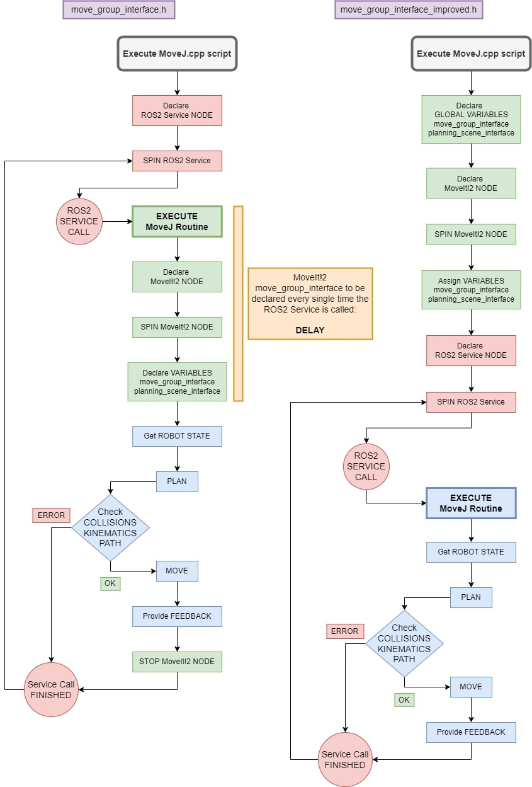

## move_group_interface_improved.h

The improvement of the move_group_interface consists of a small change in the header file which declares the Move Group Interface and its variables. As it can be appreciated, the way Robot/Gripper triggers are executed in this repository is by making service/action calls which execute different MoveIt!2 commands using the Move Group C++ Interface.

The main objective of this implementation is to improve the response time (reduce the delay) when calling different Robot/Gripper triggers using Move Group Interface (Plan + Move routine).

### Contribution

The figure below illustrates the process of calling the "Move Group Interface - Plan + Move" method in order to execute a Robot/Gripper trigger from a C++ file containing a ROS2 Service or Action Server, before and after making the improvement.

<div align="center">
    <a>
        
    </a>
</div>

The small improvement of the move_group_interface.h file consists on adding an empty constructor of the MoveGroupInterface class (line-169 of the move_group_interface_improved.h file). Before adding this element, the MoveGroupInterface class (which defines the whole MoveIt!2 framework of the Robot/Gripper being controlled) could not be declared as an empty global variable, and this is absoluteley necessary because MoveGroupInterface must be accessed twice in 2 different functions throughout the execution of the program:
- In the main() function after the MoveIt!2 node is declared. The attributes such as the Robot/Gripper and the planning group are assigned to the MoveGroupInterface class.  
- In the callback function of the ROS2 service/action. The MoveGroupInterface element is used to execute the trigger (to send commands to MoveIt!2).

Thus, the fact that MoveGroupInterface is declared as a global variable avoids having to define and assign all the attributes (which take some time for MoveIt!2 to process) every single time the ROS2 service/action is called and the callback function is executed. It has been estimated that about 1-1.5 seconds are saved every single time a trigger is executed thanks to this contribution.

### Installation

The original move_group_interface.h header file is included in the ~/opt/ros/foxy/include/moveit/move_group_interface folder in your Ubuntu 20.04 machine (if MoveIt!2 has been installed). This folder has restricted access, thus the following steps must be followed to paste the move_group_interface_improved.h file into that path:
1. Install Nautilus Admin:
    ```sh
    sudo apt-get install nautilus-admin
    ```
2. Once the installation finishes, Nautilus must be restarted:
    ```sh
    nautilus -q
    ```
3. Open the ~/opt/ros/foxy/include/moveit/move_group_interface folder -> Right click -> Open as administrator.
4. Paste the move_group_interface_improved.h file.