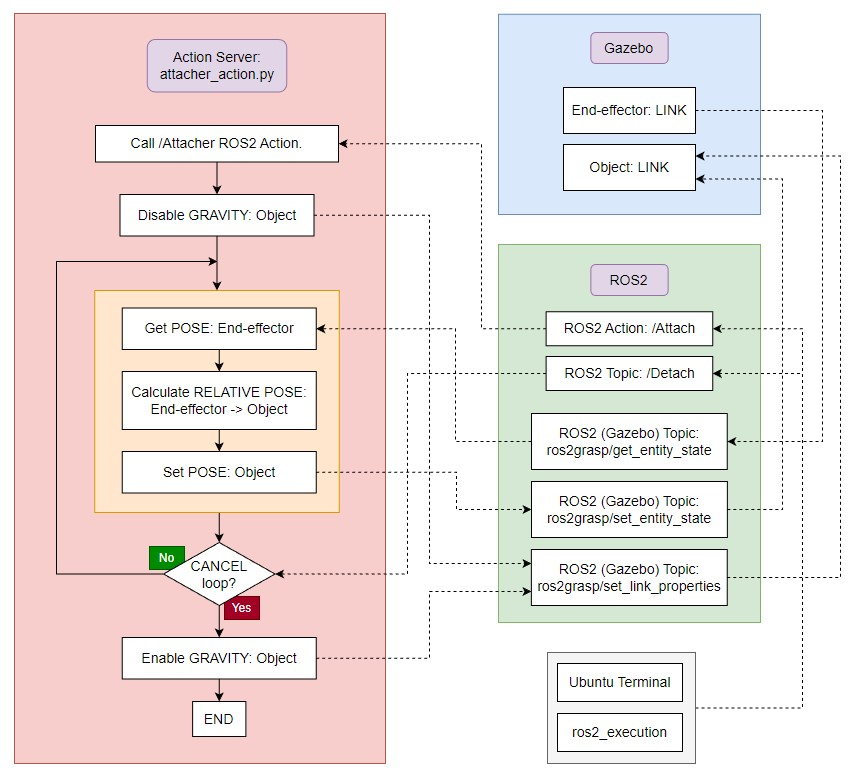

## ros2_RobotSimulation: ROS2 Grasping
Object manipulation is a common task among robot applications, and unfortunately is has not been fully implemented for ROS2-Gazebo yet. Thus, this ros2_grasping package offers a simple way of picking and placing custom objects by attaching/detaching them to a robot (end-effector).

### How does ros2_grasping work?
The diagram below represents how the /Attacher ROS2 Action Server works:

<div align="center">
    <a>
        
    </a>
</div>

attacher_action.py:
1. The process starts with a simple ROS2 Action call, which can be done from either the commandline or the ros2_execution package. This triggers the /Attacher action's Server, which executes the sequence below.
2. First of all, and before making any movements, the object's gravity property is disabled in Gazebo. This is done via the ros2grasp/set_link_properties ROS2 Service that is available in Gazebo, and helps to manipulate the object easier in simulation.
3. The following steps (3 in total) are done for every single clock cycle while the ROS2 Attacher Action Server is running:
    * The end-effector pose is obtained via ros2grasp/get_entity_state ROS2 Service (Gazebo).
    * The relative POSE (end-effector/object) is calculated in order to replicate the end-effector's movement in the object.
    * The object's pose is set via ros2grasp/set_entity_state ROS2 Service (Gazebo).
4. The loop terminates when:
    * The ROS2 Action Call is cancelled (when running from terminal).
    * A "true" (string) message is published to the /ros2_detach topic (both terminal and ros2_execution).
5. Once the Action Server finishes to move the object with the end-effector (this is supposed to happen when the robot places the object), the object's gravity property is enabled.
6. Finished!

### Requirements
The following steps must be done for the ros2_grasping package to work:

1. The "gazebo_ros_state" and "gazebo_ros_properties" plugins must be included in every single Gazebo Simulation environment. This is done by including the following tags into the .world file:
    ```sh
    <plugin name="gazebo_ros_state" filename="libgazebo_ros_state.so">
        <ros>
            <namespace>/ros2_grasp</namespace>
            <argument>model_states:=model_states</argument>
            <argument>link_states:=link_states</argument>
        </ros>
        <update_rate>1.0</update_rate>
    </plugin>

    <plugin name="gazebo_ros_properties" filename="libgazebo_ros_properties.so">
        <ros>
            <namespace>/ros2_grasp</namespace>
        </ros>
    </plugin>
    ```
2. In order to undertake the calculations of the object pose relative to the end-effector, it is necessary to generate a new link for the end-effector. The position of this new link is used to calculate the relative pose, and it has to be located where the centre of the object is while being attached by the end-effector (normally it matches the centre of the end-effector). The name of this link is the name that has to be inputted to the action call. For example, for the Schunk EGP-64 gripper (in irb120_ros2_gazebo):
    ```sh
    <!-- SMALL CUBE FOR GRIPPER PLUGIN -->

    <link name="EE_egp64">
        <inertial>
            <origin xyz="0 0 0" rpy="0 0 0" />
            <mass value="0.00001" />
            <inertia ixx="0.001" ixy="0.0" ixz="0.0" iyy="0.001" iyz="0.0" izz="0.001"/>
        </inertial>
        <visual>
            <geometry>
            <box size= "0.001 0.001 0.001" />
            </geometry>
        </visual>
    </link>
    
    <joint name="EE_egp64_joint" type="prismatic" >
        <parent link="egp64_gripper_base_link" />
        <child link="EE_egp64" />
        <limit effort="10000" lower="0.0" upper="0.0" velocity="0.0"/>
        <axis xyz="1 0 0" />
        <origin xyz="0.033 -0.018 0.15" rpy="0 0 0"/> <!-- This point is the centre between the 2 fingers of the EGP64 gripper. -->
    </joint>
    ```
3. The name of the object to be attached and the name of the link of that specific object have to be exactly the same. For example, for box.urdf:
    ```sh
    <robot name="box">

        <link name="box">
            <collision>
                <origin xyz= "0.0 0.0 0.0" rpy="0 0 0"/>
                <geometry>
                    <box size= "0.04 0.04 0.08" />
                </geometry>
                <surface>
                    <contact>
                    <collide_without_contact>false</collide_without_contact>
                    </contact>
                </surface>
                </collision>
            <visual>
                <origin xyz= "0.0 0.0 0.0" rpy="0 0 0"/>
                <geometry>
                    <box size= "0.04 0.04 0.08" />
                </geometry>
            </visual>
            <inertial>
                <origin xyz= "0.0 0.0 0.0" rpy="0 0 0"/>
                <mass value= "0.1" />
                <inertia
                    ixx="0.15" ixy="0.0"  ixz="0.0"
                    iyy="0.15" iyz="0.0"
                    izz="0.15" />
            </inertial>
        </link>

        <gazebo reference="box">
            <material>Gazebo/Red</material>
            <mu1>0.0</mu1>
            <mu2>0.0</mu2>
            <selfCollide>false</selfCollide>
        </gazebo>

    </robot>
    ```

### Usage
In order to spawn an object into a Gazebo Environment (simulation):
```sh
ros2 run ros2_grasping spawn_object.py --package "ros2_grasping" --urdf "---" --name "---" --x 0.0 --y -0.0 --z 0.0
ros2 run ros2_grasping spawn_object.py --package "ros2_grasping" --urdf "box.urdf" --name "box" --x 0.5 --y -0.3 --z 0.75 # Example for box.urdf object.
```
In order to activate the /Attach action from the Ubuntu Terminal:
```sh
ros2 action send_goal -f /Attacher ros2_grasping/action/Attacher "{object: '---', endeffector: '---'}"
```
In order to cancel the action and detach the object:
```sh
ctrl+c in the window where the action was called # Option 1 (best).
ros2 topic pub --rate 999999999 /ros2_Detach std_msgs/msg/String "{data: 'True'}" # Option 2.
```
In order to know how the /Attacher action is called in ros2_execution, please have a look [here](https://github.com/IFRA-Cranfield/ros2_RobotSimulation/tree/humble/ros2_execution).